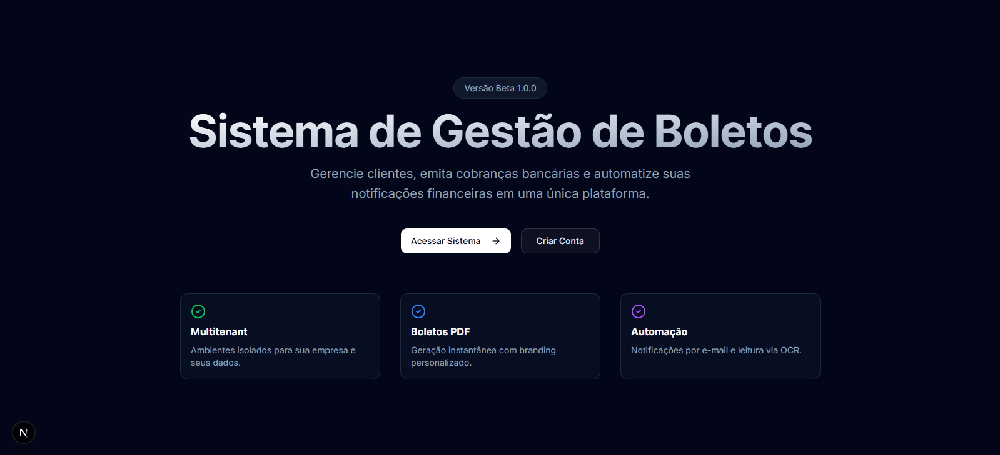

# Sistema de Gestão de Boletos (SaaS)



> _Nota: Adicione uma imagem de capa aqui para ilustrar o projeto._

## 🚀 Sobre o Projeto

O **Sistema de Gestão de Boletos** é uma plataforma SaaS (Software as a Service) desenvolvida para simplificar e automatizar a gestão financeira de empresas. Com foco em multitenancy (múltiplas empresas), o sistema permite o cadastro de clientes, emissão profissional de boletos bancários em PDF e acompanhamento financeiro através de um dashboard intuitivo.

Este projeto foi construído utilizando as tecnologias mais modernas do ecossistema React/Next.js, visando alta performance, segurança e uma experiência de usuário (UX) premium.

## ✨ Principais Funcionalidades

### 🏢 Arquitetura Multitenant

Ambientes isolados para cada empresa. Os dados de clientes, cobranças e configurações são segregados, garantindo segurança e privacidade para cada inquilino do sistema.

### 📊 Dashboard Interativo

Visão geral da saúde financeira com métricas em tempo real.
_(Local para print do Dashboard)_

<!--  -->

### 📄 Geração de Boletos em PDF

Emissão instantânea de boletos bancários com layout profissional, utilizando a biblioteca `@react-pdf/renderer`.
_(Local para print do PDF do Boleto)_

<!--  -->

### 👥 Gestão de Clientes (CRM)

Cadastro completo de clientes (sacados), permitindo histórico de cobranças e gestão de dados cadastrais.

### 🔐 Autenticação Robusta

Sistema de login e registro seguro, implementado com **NextAuth.js v5**, garantindo proteção de rotas e sessões de usuário.

## 🛠️ Tecnologias Utilizadas

O projeto foi desenvolvido com uma stack moderna e poderosa:

- **Frontend Framework**: [Next.js 16](https://nextjs.org/) (App Router)
- **Linguagem**: [TypeScript](https://www.typescriptlang.org/)
- **UI & Estilização**:
  - [React 19](https://react.dev/)
  - [Tailwind CSS](https://tailwindcss.com/)
  - [Radix UI](https://www.radix-ui.com/) (Componentes acessíveis e headless)
  - [Lucide React](https://lucide.dev/) (Ícones)
- **Backend & Banco de Dados**:
  - **Server Actions**: Lógica de backend integrada ao Next.js.
  - **Prisma ORM**: Tipagem segura e migrações de banco de dados.
  - **SQLite**: Banco de dados para desenvolvimento (fácil migração para PostgreSQL).
- **Autenticação**: [NextAuth.js v5](https://authjs.dev/) (Auth.js)
- **Validação de Dados**: [Zod](https://zod.dev/) + React Hook Form
- **PDF**: `@react-pdf/renderer`

## 💡 Jornada de Desenvolvimento

### O que foi feito

O desenvolvimento seguiu uma abordagem incremental e focada em qualidade:

1.  **Fundação e Design System**: Configuração inicial do Next.js 16 com Tailwind CSS e criação de componentes de UI reutilizáveis (botões, inputs, cards).
2.  **Landing Page**: Criação de uma página inicial atrativa e responsiva para apresentar o produto.
3.  **Sistema de Autenticação**: Implementação completa de login e registro com NextAuth v5.
4.  **Dashboard e Layout Protegido**: Desenvolvimento da área logada com sidebar, header e proteção de rotas via Middleware.
5.  **Módulo de Clientes e Boletos**: Criação dos CRUDs essenciais e da lógica de geração de PDF.

### 🚧 Dificuldades e Aprendizados

Durante o processo, enfrentamos e superamos desafios técnicos interessantes:

- **NextAuth v5 & Middleware (Edge Runtime)**:
  - _Desafio_: O Prisma ORM não roda nativamente no Edge Runtime (utilizado pelo Middleware do Next.js), causando erros ao tentar verificar sessões no banco de dados durante o roteamento.
  - _Aprendizado_: Entender a separação entre lógica "Edge-compatible" e lógica Node.js completa.

- **TypeScript Strict Mode**:
  - _Desafio_: Garantir tipagem estrita em todo o projeto, especialmente ao lidar com componentes de terceiros e respostas de API.
  - _Aprendizado_: Melhorias significativas na robustez do código ao evitar `any` e definir interfaces claras.

### 🐛 Bugs Resolvidos

Ao longo do caminho, alguns bugs críticos foram corrigidos:

1.  **Erro de "Module not found" no Middleware**:
    - _Problema_: O middleware tentava importar o Prisma Client, quebrando o build.
    - _Solução_: Refatoração da configuração do NextAuth. Criamos um arquivo `auth.config.ts` (leve, sem banco de dados) apenas para o middleware, e mantivemos o `auth.ts` (com Prisma) para o restante da aplicação.

2.  **Erro de Redeclaração de Variável**:
    - _Problema_: Conflito de nomes em variáveis exportadas no `layout.tsx`.
    - _Solução_: Ajuste nos escopos e nomes das variáveis para garantir conformidade com o TypeScript.

3.  **Tradução e Internacionalização**:
    - _Problema_: Botões e textos hardcoded dificultavam a expansão.
    - _Solução_: Padronização dos textos e preparação para i18n futura.

### 🐛 Bugs não Resolvidos.
1. na aba de automação esta dando "404
This page could not be found." no qual estou em processo para resolver.

## 🚀 Como Rodar o Projeto

Siga os passos abaixo para executar o projeto em sua máquina local:

### Pré-requisitos

- Node.js (versão 18 ou superior)
- NPM ou Yarn

### Instalação

1.  **Clone o repositório**:

    ```bash
    git clone https://github.com/seu-usuario/projeto-sistema-saas.git
    cd projeto-sistema-saas
    ```

2.  **Instale as dependências**:

    ```bash
    npm install
    # ou
    yarn install
    ```

3.  **Configure o Banco de Dados**:
    O projeto usa SQLite por padrão, então não é necessário configurar um container Docker. Apenas gere o arquivo do banco:

    ```bash
    npx prisma generate
    npx prisma migrate dev --name init
    ```

4.  **Configure as Variáveis de Ambiente**:
    Crie um arquivo `.env` na raiz do projeto e adicione a chave secreta para a autenticação:

    ```env
    AUTH_SECRET="sua-chave-secreta-gerada-aqui"
    # Para gerar uma chave: `openssl rand -base64 32`
    DATABASE_URL="file:./dev.db"
    ```

5.  **Rode o Servidor de Desenvolvimento**:

    ```bash
    npm run dev
    ```

6.  **Acesse o Projeto**:
    Abra [http://localhost:3000](http://localhost:3000) no seu navegador.

---

Desenvolvido com 💙 por [Adriel Luniere]
